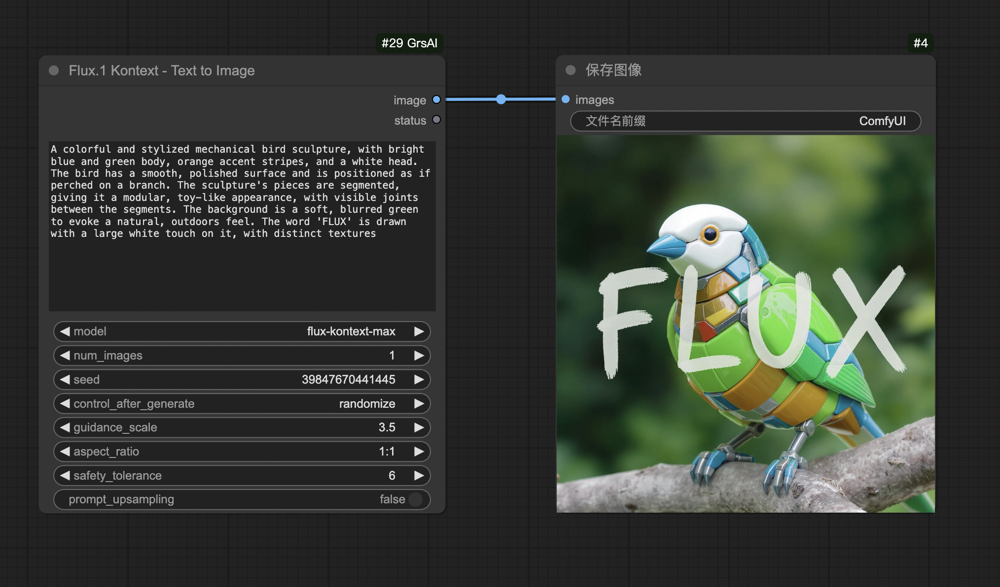
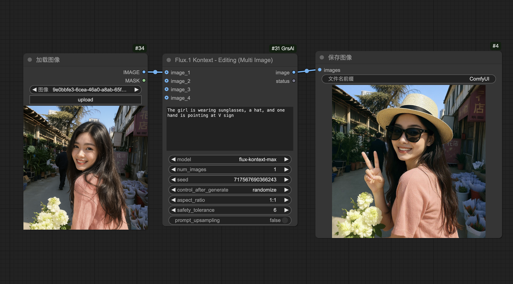
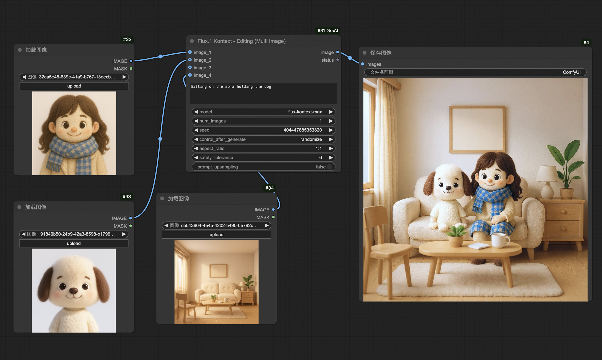

# ComfyUI-GrsAI

**强大的多模型图像生成** ComfyUI 自定义节点，使用GrsAI官方API，支持文生图、图生图、多图融合和批量生图。
支持6种主流模型，价格低至￥0.02/次。

## 🚀 概述

ComfyUI-GrsAI 是一个专业的 ComfyUI 扩展，提供完整的多模型图像生成功能。支持6种主流AI模型，经过深度优化，为用户提供最简洁的配置体验和最强大的功能支持。

## 📸 功能演示

### 🎨 文生图模式

使用 **GrsAI - Text to Image** 节点，纯文本生成高质量图像：



*生成效果：基于文字描述创建的老虎眼睛特写，细节丰富，质感逼真*

### 🖼️ 图生图模式

使用 **GrsAI - Image to Image** 节点，基于输入图像进行智能编辑：



*生成效果：基于提示词"坐在沙发上的角色和达尔马提亚犬"，同时生成4张不同变化的图像*

### 🎭 多图融合模式

使用 **GrsAI - Multi Image Fusion** 节点，融合多个参考图像：



*复杂工作流：使用多个参考图像（人物+小狗）进行智能融合，创造出和谐统一的场景*

### ✨ 核心特性

- 🎨 **四种生成模式** - 文生图、图生图、多图融合、批量生图，满足所有创作需求
- 🔥 **六种模型支持** - 从经济实惠的GPT Image到顶级的Flux Kontext Max，质量与价格自由选择
- ⚡ **批量生成** - 支持批量生图，智能并发提升效率
- 🛡️ **零技术门槛** - 只需一个API密钥，自动处理所有技术细节
- 🎯 **专业参数控制** - 完整支持种子、指导强度、推理步数、宽高比等参数
- 🌟 **优雅的用户界面** - 简洁的状态反馈，清晰的生成进度提示

### 🔥 项目优势

- **🔑 超简化配置** - 仅需配置GrsAI密钥，无需额外的第三方服务配置
- **📱 友好的反馈** - 中文界面，emoji状态提示，清晰的成功/失败统计
- **🚀 高性能** - 智能并发生成，多图同时处理，大幅提升生成速度
- **🛡️ 稳定可靠** - 完善的错误处理，自动重试机制，确保生成成功率
- **💰 价格实惠** - 多种模型选择，价格低至￥0.02/次

---

## 💰 模型价格

我们支持6种主流AI图像生成模型，价格透明，按次计费：

| 模型名称 | 价格（人民币） | 价格（美元） | 特点 |
|---------|---------------|-------------|------|
| **GPT Image** | ￥0.02 | $0.0027 | 上下文理解，综合能力强，支持中文理解 |
| **flux-dev** | ￥0.025 | $0.003 | 开发版本，性价比高 |
| **Flux Pro 1.1** | ￥0.03 | $0.0041 | 专业级质量 |
| **Flux Pro 1.1 Ultra** | ￥0.04 | $0.0054 | 超高质量 |
| **Flux Kontext Pro** | ￥0.035 | $0.0047 | 上下文理解强 |
| **Flux Kontext Max** | ￥0.07 | $0.0095 | 上下文理解强，支持中文理解 |

*注：价格可能根据官网实时调整，以GrsAI官网为准*

---

## 📦 安装方法 (第一次重启安装完成后，关闭ComfyUI，填写 .env 文件中的api-key。再重启一遍 ComfyUI 即可运行)

### 方法一：通过 ComfyUI Manager 安装（推荐）

1. 在 ComfyUI 界面中打开 **ComfyUI Manager**
2. 点击 **"Install via Git URL"**
3. 输入：`https://github.com/31702160136/ComfyUI-GrsAI.git`
4. 第一次重启安装完成后，关闭ComfyUI，填写 .env 文件中的api-key。再重启一遍 ComfyUI 即可运行。

### 方法二：手动安装

#### 方式A：通过 Git 克隆（推荐）

```bash
# 进入 ComfyUI 的 custom_nodes 目录
cd ComfyUI/custom_nodes/

# 克隆项目
git clone https://github.com/31702160136/ComfyUI-GrsAI.git
cd ComfyUI-GrsAI

# 安装依赖
pip install -r requirements.txt
```

#### 方式B：下载 ZIP 文件

1. 访问 [项目页面](https://github.com/31702160136/ComfyUI-GrsAI)
2. 点击绿色 **"Code"** 按钮 → **"Download ZIP"**
3. 解压到 `ComfyUI/custom_nodes/` 目录
4. **重要**: 将解压后的文件夹从 `ComfyUI-GrsAI-main` 重命名为 `ComfyUI-GrsAI`

```bash
# 安装依赖
cd ComfyUI/custom_nodes/ComfyUI-GrsAI
pip install -r requirements.txt
```

### 便携版用户特别说明

便携版用户需要使用ComfyUI自带的Python环境安装依赖：

**Git 克隆方式：**

```powershell
# 在 ComfyUI 根目录执行 例如：PS E:\ComfyUI_windows_portable_nvidia\ComfyUI_windows_portable>
 .\python_embeded\python.exe -m pip install --force-reinstall -r .\ComfyUI\custom_nodes\ComfyUI-GrsAI\requirements.txt
```

**ZIP 下载方式：**

```powershell
# ⚠️ 注意：如果是下载ZIP解压，文件夹名称为 ComfyUI-GrsAI-main
# 请先重命名文件夹，或使用以下命令：
 .\python_embeded\python.exe -m pip install --force-reinstall -r .\ComfyUI\custom_nodes\ComfyUI-GrsAI-main\requirements.txt

# 重命名后推荐使用：
 .\python_embeded\python.exe -m pip install --force-reinstall -r .\ComfyUI\custom_nodes\ComfyUI-GrsAI\requirements.txt
```

---

## 🔑 API密钥设置

### 获取 API 密钥

您只需要获取 **一个** API 密钥：

- **GrsAI密钥**: 访问 [GrsAI官网](https://grsai.com) 登录后在控制台获取

### 配置方法

插件已经包含了 `.env` 配置模板文件，您只需要：

1. **打开配置文件**: `ComfyUI/custom_nodes/ComfyUI-GrsAI/.env`
2. **替换 API 密钥**: 将 `sk-xxxxx` 替换为您的真实密钥

```env
GRSAI_API_KEY=your_grsai_api_key_here
```

**配置位置**: `ComfyUI/custom_nodes/ComfyUI-GrsAI/.env`

### 配置完成

保存文件后重启 ComfyUI 即可使用！

---
<!-- 
## ⚙️ 参数说明

### 核心参数

- **prompt** (文本提示词): 描述您想要生成的图像
- **model**: 选择生成模型
  - `gpt-image`: 经济实惠，快速生成，适合批量处理
  - `flux-dev`: 开发版本，性价比高，适合测试
  - `flux-pro-1.1`: 专业级质量，平衡性能与价格
  - `flux-kontext-pro`: 上下文理解强，适合复杂场景
  - `flux-pro-1.1-ultra`: 超高质量，追求极致效果
  - `flux-kontext-max`: 顶级模型，最佳生成效果
- **num_images**: 生成数量 (1/2/4 张)
- **seed**: 随机种子 (0=随机，其他=固定)

### 高级参数

- **guidance_scale**: 指导强度 (0.0-10.0)
  - 值越高，越严格遵循提示词
- **num_inference_steps**: 推理步数 (1-100)
  - 步数越多，细节越丰富
- **aspect_ratio**: 宽高比选择
  - 支持 21:9、16:9、4:3、1:1、3:4、9:16、9:21
- **output_format**: 输出格式 (PNG/JPEG)
- **safety_tolerance**: 安全容忍度 (0-6)
- **prompt_upsampling**: 提示词增强 (开启/关闭) -->

---

## 📋 系统要求

- **Python** >= 3.8
- **ComfyUI** (最新版本)
- **依赖包**:
  - requests
  - python-dotenv
  - httpx
  - httpcore

---

## 🐛 故障排除

### 节点相关问题

**节点没有出现？**

- 完全重启 ComfyUI
- 检查插件安装路径：`ComfyUI/custom_nodes/ComfyUI-GrsAI`
- 确认依赖安装成功：`pip list | grep httpx`

**节点显示红色错误？**

- 检查 `.env` 文件是否存在
- 验证 API 密钥格式：`GRSAI_API_KEY=your_key_here`
- 重启 ComfyUI

### API 相关问题

**生成失败？**

- 检查GrsAI账户余额
- 查看节点状态信息获取详细错误

---

## 🔮 更新日志

### v1.0.0

- ✨ **全新发布** - 四种生成模式完整支持
- 🔑 **简化配置** - 仅需一个 API 密钥
- ⚡ **批量优化** - 智能批处理和并发生成
- 🌟 **用户体验** - 中文界面，友好反馈
- 🛡️ **稳定性** - 完善错误处理和重试机制
- 💰 **多模型支持** - 6种模型，价格从￥0.02起

---

## 📄 许可证

本项目采用 MIT 许可证 - 详见 [LICENSE](LICENSE) 文件。

---

## 🤝 贡献与支持

### 贡献代码

欢迎提交 Issue 和 Pull Request！

1. Fork 本项目
2. 创建功能分支
3. 提交代码更改
4. 发起 Pull Request

### 获取支持

- **项目文档**: GitHub 仓库
- **问题反馈**: GitHub Issues
- **GrsAI官网**: [grsai.com](https://grsai.com)
- **API文档**: [grsai.com](https://grsai.com/dashboard/documents)

---

## 🔗 相关链接

- **GrsAI官网**: [grsai.com](https://grsai.com)
- **ComfyUI**: [github.com/comfyanonymous/ComfyUI](https://github.com/comfyanonymous/ComfyUI)
- **Flux模型**: [Black Forest Labs](https://bfl.ai/)
- **GPT模型**: [Black Forest Labs](https://openai.com/)

---

**⭐ 如果这个项目对您有帮助，请给我们一个星标！您的支持是我们持续改进的动力！**
